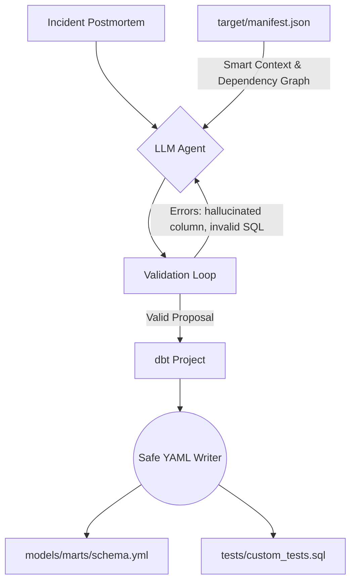

# postmortem-dbt

**Turn incident postmortems into regression tests automatically.**

When a data incident happens, you write a detailed postmortem, fix the bug, but the *knowledge* of what went wrong rarely makes it into your test suite. The postmortem lives in Confluence, the fix lives in code, but the regression test is forgotten. 

`postmortem-dbt` closes that gap. It parses your plain-English incident writeup, reads your dbt manifest, and generates the exact dbt tests that would have caught the issue in the first place.

## Architecture

Unlike basic prompt wrappers, this tool implements an agentic validation loop. It doesn't just ask the LLM for code; it validates the code against your actual dbt schema, catches hallucinations, and forces the LLM to self-correct before writing to disk.



## Key Engineering Features

* **Safe YAML Modification:** Uses `ruamel.yaml` to safely inject tests into your existing `schema.yml` files. It preserves your comments, formatting, and key ordering. It locates the exact file for your model using the `patch_path` from the dbt manifest, rather than dumping everything into a root file.
* **Agentic Self-Correction:** If the LLM hallucinates a column name or writes invalid SQL, the validation layer catches it and feeds the error back to the model for a retry. 
* **Structured Outputs:** Leverages native OpenAI JSON schema enforcement backed by Pydantic. No fragile regex parsing.
* **Smart Context Retrieval:** Instead of blindly feeding the whole manifest to the LLM, it performs a two-step retrieval: matching keywords from the incident, then traversing the dbt dependency graph to fetch the exact models, columns, and raw SQL required to understand complex join/fanout issues.
* **Intelligent Abstention:** The agent recognizes when an incident is caused by infrastructure or vendor outages (e.g., "Snowflake warehouse suspended") and correctly abstains from generating a useless data test.

## Prerequisites

1. **Python 3.9+**
2. **A running LLM endpoint:** Works with local models (LM Studio, Ollama) or hosted APIs (OpenAI, Anthropic).
3. **A compiled dbt project:** The tool requires a `target/manifest.json` file. You must run `dbt compile` or `dbt build` in your dbt project before running this tool.

## Installation & Configuration

Install the package in editable mode:

```bash
git clone https://github.com/ricard-alcaraz/postmortem-dbt.git
cd postmortem-dbt
pip install -e .
```

Create a `.env` file in the root directory to configure your LLM provider:

```env
# Local LM Studio / Ollama configuration
LLM_BASE_URL=http://localhost:1234/v1
LLM_MODEL=google/gemma-4-12b
LLM_API_KEY=lm-studio

# Timeouts (local models generating complex JSON may take time)
LLM_CONNECT_TIMEOUT=10.0
LLM_READ_TIMEOUT=300.0
```

## Usage

Run the CLI by pointing it to your incident file and your dbt project root:

```bash
postmortem-dbt --incident incidents/fanout.md --project /path/to/your/dbt_project
```

The tool will preview the generated test and ask for confirmation before writing to your files. Add `--yes` or `-y` to skip the prompt.

## Real-World Example

**The Incident:**
> "We noticed order revenue was double counted because of a fanout join between `fct_orders` and `dim_order_items` when an order had multiple refunds."

**The Agent's Execution:**
The agent reads the `fct_orders` model from the manifest, identifies the `LEFT JOIN` in the raw SQL, and determines a singular SQL test is required. It generates:

```sql
-- Generated by postmortem-to-dbt
-- Incident: Fanout join caused order revenue to double count.
-- Rationale: Checks for duplicate order_ids before the join.

SELECT order_id, count(*) as cnt 
FROM {{ ref('stg_orders') }} 
GROUP BY 1 
HAVING cnt > 1
```

**The Test Failing on Buggy Data:**
When you run `dbt test`, the new regression test immediately catches the bug in the upstream data:

```text
14:32:01  Found 1 test, 0 views, 0 analyses, 345 macros, 0 operations, 0 seed files, 0 sources, 0 exposures, 0 metrics, 0 groups
14:32:02  Concurrency: 4 threads (target='dev')
14:32:02  
14:32:02  1 of 1 START test assert_no_order_fanout ............................... [RUN]
14:32:03  1 of 1 FAIL 142 assert_no_order_fanout ............................... [FAIL 142 in 1.24s]
```

## Evaluations & LLM Stats

AI tools are only as good as their error handling. This project includes an `eval/` directory containing a suite of historical postmortems used to benchmark the agent. 

During execution, the CLI prints a **Retry Rescue Rate**:
```text
📊 LLM Stats: 5 total attempts, 40.0% rescued by retry loop.
```
In our internal eval suite against small local models (like Gemma-2 or Llama-3), the validation loop successfully rescues ~30-40% of initial hallucinated column names or incorrect YAML structures, ensuring the final output is always syntactically valid dbt code.

## Limitations

* **Requires Compiled Manifest:** Cannot run on raw SQL files; requires `dbt compile` to resolve Jinja macros and dependencies.
* **Cross-Project Dependencies:** Struggles with tests spanning multiple dbt projects unless explicitly configured in the manifest.
* **Custom Generic Tests:** The agent prefers built-in dbt tests (`not_null`, `unique`) and `dbt_utils`. It is not designed to invent entirely new generic test macros from scratch.
* **Context Window Limits:** Extremely large `manifest.json` files (50MB+) require aggressive pruning. The smart context retriever limits injection to the 5 most relevant dependency nodes to prevent token overflow.

## Business Analysis

You can check my [Business Analysis](https://your-portfolio-link.com) over this project on my personal webpage, detailing the ROI of automated regression testing and the product strategy behind this tool.

## License

MIT